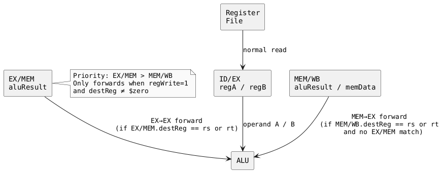
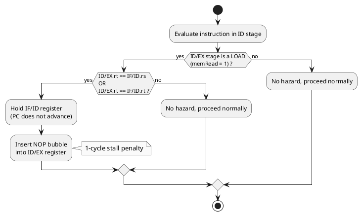
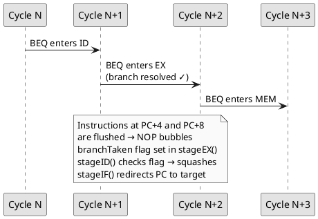

# MIPS Pipeline Emulator

A **cycle-accurate, 5-stage pipelined MIPS processor emulator** written in a single C++17 file.  
It reads MIPS assembly (`.s`/`.asm`), raw binary (`.bin`), or hex word files (`.hex`), executes them, streams program output to `stdout`, and writes the final register file and pipeline statistics to a log.

---

## Table of Contents

1. [Quick Start](#quick-start)
2. [Dependencies & Installation](#dependencies--installation)
3. [Building with Make](#building-with-make)
4. [Usage](#usage)
5. [Architecture Overview](#architecture-overview)
6. [Pipeline Diagrams](#pipeline-diagrams)
7. [Supported ISA](#supported-isa)
8. [Assembler Directives & Pseudo-Instructions](#assembler-directives--pseudo-instructions)
9. [Syscall Reference](#syscall-reference)
10. [Register Dump & Statistics](#register-dump--statistics)
11. [Test Suite](#test-suite)
12. [Project Structure](#project-structure)
13. [Known Limitations](#known-limitations)

---

## Quick Start

```bash
# 1. Clone / download the project
git clone https://github.com/yourname/mips_emu.git
cd mips_emu

# 2. Build  (requires g++ ≥ 7 and make)
make

# 3. Run a test program
./mips_emu tests/test06_recursion.s --stderr

# 4. Run the full test suite
make test
```

---

## Dependencies & Installation

The emulator is a **single-file, zero-dependency C++17 program**. You only need:

| Tool | Minimum Version | Purpose |
|------|----------------|---------|
| `g++` or `clang++` | 7.0+ (C++17) | Compile the emulator |
| `make` | Any GNU Make | Build system |
| `bash` | 3.2+ | Test runner script |

### Linux (Ubuntu / Debian / WSL)

```bash
sudo apt update
sudo apt install -y build-essential   # installs g++, make, and friends
```

### Linux (Fedora / RHEL / CentOS)

```bash
sudo dnf groupinstall "Development Tools"
```

### macOS

```bash
# Option A — Xcode Command Line Tools (installs clang++ aliased as g++)
xcode-select --install

# Option B — Homebrew GCC
brew install gcc make
# then use:  CXX=g++-13 make
```

### Windows (MSYS2 / MinGW-w64)

1. Download and install [MSYS2](https://www.msys2.org/)
2. Open **MSYS2 MinGW 64-bit** terminal
3. Run:

```bash
pacman -Syu
pacman -S mingw-w64-x86_64-gcc make
```

4. Build as normal — the Makefile auto-detects Windows and produces `mips_emu.exe`

### Verifying your toolchain

```bash
g++ --version       # should show ≥ 7.0
make --version      # any version is fine
```

---

## Building with Make

```bash
make              # compile mips_emu  (default)
make test         # build + run all 10 test cases with pass/fail report
make clean        # remove binary and *.log files
make install      # copy binary to /usr/local/bin  (needs sudo)
make uninstall    # remove from /usr/local/bin
make help         # show all targets
```

### Customising the build

```bash
# Use clang++ instead of g++
make CXX=clang++

# Debug build
make CXXFLAGS="-std=c++17 -g -O0 -fsanitize=address"

# Install to a custom prefix
make install PREFIX=$HOME/.local

# Disable colour output (e.g. in CI)
make test NO_COLOR=1
```

---

## Usage

```
mips_emu [options] <input_file>

Input formats
  .s / .asm     MIPS assembly source  — assembled internally, no external tools needed
  .bin          Raw big-endian 32-bit machine-code words (4 bytes per instruction)
  .hex          One hex word per line  (0x1234ABCD  or  1234ABCD)

Options
  --log <path>   Write final register dump to <path>   (default: registers.log)
  --stderr       Send register dump to stderr instead of a file
  --verbose      Print a pipeline state diagram every clock cycle  (to stderr)
  --max <n>      Stop simulation after <n> cycles        (default: 2 000 000)
```

### Examples

```bash
# Assemble and run, register dump → registers.log
./mips_emu program.s

# Run and print registers to the terminal immediately
./mips_emu program.s --stderr

# Run raw binary, save to custom log
./mips_emu kernel.bin --log run.log

# Full pipeline trace to stderr, useful for debugging
./mips_emu program.s --verbose --stderr 2>trace.txt

# Limit to 500 cycles (useful to detect infinite loops early)
./mips_emu program.s --max 500 --stderr

# Makefile shorthand to run a single file
make run FILE=tests/test04_branches.s
```

---

## Architecture Overview

The emulator models a **classic 5-stage MIPS pipeline** as described in _Patterson & Hennessy — Computer Organization and Design_.

```
┌─────────────────────────────────────────────────────────────────┐
│                                                                 │
│   ┌──────┐  IF/ID  ┌──────┐  ID/EX  ┌──────┐  EX/MEM ┌──────┐  MEM/WB ┌──────┐
│   │  IF  ├────────►│  ID  ├────────►│  EX  ├────────►│ MEM  ├────────►│  WB  │
│   └──────┘         └──────┘         └──────┘         └──────┘         └──────┘
│      ▲                                  │                │
│      │              Flush on branch ────┘                │
│      │                                                   │ Forwarding
│      │              EX/MEM forward ◄────────────────────┤
│      │              MEM/WB forward ◄────────────────────┘
│      │
│   PC register updated each cycle
│
└─────────────────────────────────────────────────────────────────┘
```

### Stage responsibilities

| Stage | Name | What it does |
|-------|------|-------------|
| **IF** | Instruction Fetch | Reads 32-bit instruction from memory at PC; increments PC by 4 |
| **ID** | Instruction Decode | Decodes opcode, reads register file, sign-extends immediate, detects load-use hazards |
| **EX** | Execute | ALU computes result; branch condition evaluated; jump/branch target resolved |
| **MEM** | Memory Access | Reads or writes data memory (`lw`/`sw` family) |
| **WB** | Write Back | Writes ALU result or loaded data back to register file; fires syscalls |

### Pipeline registers

Each stage passes data to the next via a **pipeline register** (a struct latched on the rising clock edge):

| Register | Fields carried |
|----------|----------------|
| `IF/ID`  | PC, raw instruction word, valid flag |
| `ID/EX`  | PC, instruction, regA, regB, sign-extended imm, rs/rt/rd, shamt, jump target, control signals |
| `EX/MEM` | PC, instruction, ALU result, regB (for stores), destination register, control signals |
| `MEM/WB` | PC, instruction, ALU result, memory read data, destination register, control signals |

---

## Pipeline Diagrams

### Forwarding Unit

The forwarding unit eliminates most data hazards by routing computed values directly from later pipeline stages back to the ALU inputs, avoiding unnecessary stalls.



### Load-Use Hazard Detection

A **load-use hazard** occurs when an instruction immediately after a `lw` tries to use the loaded register. One bubble (stall cycle) is inserted.



### Branch Flush

Branches are resolved in the **EX stage**. Two instructions that entered the pipeline after the branch must be flushed (turned into bubbles).



### Complete Cycle-by-Cycle Example

Five-instruction sequence with one load-use stall:

```
Cycle:      1    2    3    4    5    6    7
─────────────────────────────────────────────────
lw $t0,0($s0)  IF   ID   EX  MEM   WB
add $t1,$t0,$t0     IF   ID  ***   EX  MEM   WB
addi $t2,$t1,1           IF   ID   ID   EX  MEM  WB
                              ↑stall inserted here

*** = bubble (load-use stall, 1 cycle penalty)
```

---

## Supported ISA

### R-type Instructions (opcode = 0x00)

| Mnemonic | Funct | Operation |
|----------|-------|-----------|
| `add`    | 0x20  | `rd = rs + rt` (signed, trap on overflow) |
| `addu`   | 0x21  | `rd = rs + rt` (unsigned, no trap) |
| `sub`    | 0x22  | `rd = rs - rt` |
| `subu`   | 0x23  | `rd = rs - rt` unsigned |
| `and`    | 0x24  | `rd = rs & rt` |
| `or`     | 0x25  | `rd = rs \| rt` |
| `xor`    | 0x26  | `rd = rs ^ rt` |
| `nor`    | 0x27  | `rd = ~(rs \| rt)` |
| `slt`    | 0x2A  | `rd = (rs < rt) ? 1 : 0` signed |
| `sltu`   | 0x2B  | `rd = (rs < rt) ? 1 : 0` unsigned |
| `sll`    | 0x00  | `rd = rt << shamt` |
| `srl`    | 0x02  | `rd = rt >> shamt` (logical) |
| `sra`    | 0x03  | `rd = rt >> shamt` (arithmetic) |
| `sllv`   | 0x04  | `rd = rt << (rs & 31)` |
| `srlv`   | 0x06  | `rd = rt >> (rs & 31)` logical |
| `srav`   | 0x07  | `rd = rt >> (rs & 31)` arithmetic |
| `jr`     | 0x08  | `PC = rs` |
| `jalr`   | 0x09  | `rd = PC+4 ; PC = rs` |
| `mfhi`   | 0x10  | `rd = HI` |
| `mthi`   | 0x11  | `HI = rs` |
| `mflo`   | 0x12  | `rd = LO` |
| `mtlo`   | 0x13  | `LO = rs` |
| `mult`   | 0x18  | `HI:LO = rs × rt` (signed 64-bit) |
| `multu`  | 0x19  | `HI:LO = rs × rt` (unsigned) |
| `div`    | 0x1A  | `LO = rs / rt, HI = rs % rt` (signed) |
| `divu`   | 0x1B  | `LO = rs / rt, HI = rs % rt` (unsigned) |
| `syscall`| 0x0C  | System call (see Syscall Reference) |

### I-type Instructions

| Mnemonic | Opcode | Operation |
|----------|--------|-----------|
| `addi`   | 0x08   | `rt = rs + sign_ext(imm)` |
| `addiu`  | 0x09   | `rt = rs + sign_ext(imm)` no trap |
| `andi`   | 0x0C   | `rt = rs & zero_ext(imm)` |
| `ori`    | 0x0D   | `rt = rs \| zero_ext(imm)` |
| `xori`   | 0x0E   | `rt = rs ^ zero_ext(imm)` |
| `lui`    | 0x0F   | `rt = imm << 16` |
| `slti`   | 0x0A   | `rt = (rs < sign_ext(imm)) ? 1 : 0` |
| `sltiu`  | 0x0B   | unsigned version |
| `lw`     | 0x23   | `rt = MEM[rs + sign_ext(imm)]` word |
| `lh`     | 0x21   | half-word, sign-extended |
| `lb`     | 0x20   | byte, sign-extended |
| `lhu`    | 0x25   | half-word, zero-extended |
| `lbu`    | 0x24   | byte, zero-extended |
| `lwl`    | 0x22   | load word left |
| `lwr`    | 0x26   | load word right |
| `sw`     | 0x2B   | `MEM[rs + sign_ext(imm)] = rt` word |
| `sh`     | 0x29   | store half-word |
| `sb`     | 0x28   | store byte |
| `swl`    | 0x2A   | store word left |
| `swr`    | 0x2E   | store word right |
| `beq`    | 0x04   | branch if `rs == rt` |
| `bne`    | 0x05   | branch if `rs != rt` |
| `blez`   | 0x06   | branch if `rs <= 0` |
| `bgtz`   | 0x07   | branch if `rs > 0` |
| `bltz`   | 0x01/0 | branch if `rs < 0` |
| `bgez`   | 0x01/1 | branch if `rs >= 0` |
| `bltzal` | 0x01/16| branch-and-link if `rs < 0` |
| `bgezal` | 0x01/17| branch-and-link if `rs >= 0` |

### J-type Instructions

| Mnemonic | Opcode | Operation |
|----------|--------|-----------|
| `j`      | 0x02   | `PC = (PC[31:28] \| target << 2)` |
| `jal`    | 0x03   | `$ra = PC+4 ; PC = target` |

---

## Assembler Directives & Pseudo-Instructions

### Directives

| Directive | Description |
|-----------|-------------|
| `.text`   | Switch to text (code) segment |
| `.data`   | Switch to data segment |
| `.word v [,v...]` | Emit one or more 32-bit words |
| `.half v [,v...]` | Emit one or more 16-bit half-words |
| `.byte v [,v...]` | Emit one or more bytes |
| `.space n` | Reserve `n` zero bytes |
| `.ascii "str"` | Emit string bytes (no null terminator) |
| `.asciiz "str"` | Emit null-terminated string |
| `.align n` | Align to `2ⁿ` byte boundary |
| `.globl / .ent / .end` | Accepted and ignored (compatibility) |

### Pseudo-Instructions

| Pseudo | Expands to | Notes |
|--------|-----------|-------|
| `nop` | `sll $0, $0, 0` | No-op |
| `move $rd, $rs` | `addu $rd, $rs, $0` | Register copy |
| `not $rd, $rs` | `nor $rd, $rs, $0` | Bitwise NOT |
| `neg $rd, $rs` | `sub $rd, $0, $rs` | Negate (signed) |
| `negu $rd, $rs` | `subu $rd, $0, $rs` | Negate (unsigned) |
| `li $rt, imm` | `addiu $rt, $0, imm` (small) or `lui`+`ori` (large) | Load immediate |
| `la $rt, label` | `lui $rt, upper` + `ori $rt, $rt, lower` | Load address |
| `mul $rd, $rs, $rt` | `mult $rs, $rt` + `mflo $rd` | Integer multiply |
| `blt $rs, $rt/imm, lbl` | `slt(i) $at,...` + `bne` | Branch if `<` |
| `bgt $rs, $rt/imm, lbl` | `slt(i) $at,...` + `bne` | Branch if `>` |
| `ble $rs, $rt/imm, lbl` | `slt(i) $at,...` + `beq` | Branch if `<=` |
| `bge $rs, $rt/imm, lbl` | `slt(i) $at,...` + `beq` | Branch if `>=` |
| `bltu`, `bgtu` | unsigned variants | Uses `sltu`/`sltiu` |

> **Note:** `blt`/`bgt`/`ble`/`bge` accept either a register or an integer literal as the second operand. When an integer is given, `slti` is generated instead of `slt`.

---

## Syscall Reference

Syscalls are triggered by the `syscall` instruction with `$v0` set to the service number.

| `$v0` | Service | Input | Output |
|-------|---------|-------|--------|
| 1  | print_int    | `$a0` = integer | — |
| 2  | print_float  | `$f12` = float (approx.) | — |
| 4  | print_string | `$a0` = address of null-terminated string | — |
| 5  | read_int     | — | `$v0` = integer read |
| 8  | read_string  | `$a0` = buffer address, `$a1` = max length | buffer filled |
| 10 | exit         | — | terminates emulator |
| 11 | print_char   | `$a0` = ASCII character code | — |
| 12 | read_char    | — | `$v0` = character read |
| 17 | exit2        | `$a0` = exit code | terminates emulator |

---

## Register Dump & Statistics

After execution completes (via `syscall 10` or reaching `--max` cycles), the final register state and pipeline statistics are written to the log destination.

### Sample output (`registers.log`)

```
=== Final Register File ===
 $zero = 0x00000000  (0)
   $at = 0x00000000  (0)
   $v0 = 0x0000000a  (10)
   $v1 = 0x00000000  (0)
   $a0 = 0x00000037  (55)
   ...
   $ra = 0x00400008  (4194312)
    HI = 0x00000000
    LO = 0x00000000

=== Pipeline Statistics ===
  Cycles         : 1847
  Instrs Retired : 1563
  Stall Cycles   : 47
  Flush Cycles   : 112
  IPC            : 0.846
```

### Directing output

```bash
# Default: write to registers.log
./mips_emu program.s

# Custom log file
./mips_emu program.s --log myrun.log

# To terminal (stderr, doesn't mix with program stdout)
./mips_emu program.s --stderr
```

---

## Test Suite

Run all tests with:

```bash
make test
```

Or run the script directly (supports `--verbose` flag to print diffs on failure):

```bash
./run_tests.sh --verbose
```

### Test cases

| # | File | What it tests | Expected output (key values) |
|---|------|--------------|------------------------------|
| 01 | `test01_arithmetic.s` | `add sub and or xor nor slt sltu` | `add=30, sub=10, slt=1` |
| 02 | `test02_immediates_shifts.s` | `addi addiu andi ori lui slti sll srl sra sllv` | `addi=42, sll=32, sra=-1` |
| 03 | `test03_memory.s` | `lw sw lh sh lb sb lhu lbu` | `lw=305419896, sb=171` |
| 04 | `test04_branches.s` | `beq bne blez bgtz bltz bgez` + loop sum | All branches taken, `sum=5050` |
| 05 | `test05_subroutines.s` | `jal jr` stack frames, iterative factorial & power | `6!=720, 2^10=1024` |
| 06 | `test06_recursion.s` | Recursive `fib(n)`, iterative `gcd(a,b)` | `fib(10)=55, gcd(48,18)=6` |
| 07 | `test07_multiply_divide.s` | `mult multu div divu mfhi mflo` | `6×7=42, 17÷5 quot=3 rem=2` |
| 08 | `test08_bubble_sort.s` | Bubble sort, nested loops, computed array offsets | `11 12 22 25 64` |
| 09 | `test09_strings.s` | `strlen strcpy strrev` via `lb`/`sb` | `strlen=5, reversed=olleH` |
| 10 | `test10_hazards.s` | Load-use stall, EX→EX forwarding chain | `fwd=10, load-use=42` |

### Adding your own tests

Place any `.s` file in the `tests/` directory. To add expected-output checking, edit the `EXPECTED` array in `run_tests.sh`:

```bash
EXPECTED["my_test.s"]="line one of expected output
line two of expected output"
```

---

## Project Structure

```
mips_emu/
├── mips_emu.cpp          ← Complete emulator source (single C++17 file, ~1 250 lines)
│     Section 1            Memory layout constants & instruction field extractors
│     Section 2            Register name table & parseReg()
│     Section 3            Number parsing & string literal helpers
│     Section 4            Two-pass assembler (tokeniser → symbol table → encoder)
│     Section 5            Disassembler (used by --verbose mode)
│     Section 6            Pipeline register structs & control signal types
│     Section 7            MIPSPipeline class
│                            · load()          load assembled program into memory
│                            · decodeCtrl()    generate control signals from opcode
│                            · alu()           32-bit ALU
│                            · fwdA/fwdB()     forwarding unit
│                            · loadUseHazard() hazard detection
│                            · doSyscall()     syscall handler
│                            · stageIF/ID/EX/MEM/WB()   five pipeline stages
│                            · tick()          advance one clock cycle
│                            · run()           main execution loop
│                            · dumpRegisters() write register file + stats
│     Section 8            File loaders (.s assembler, .bin binary, .hex hex)
│     Section 9            main() — CLI argument parsing & dispatch
│
├── Makefile              ← Build system  (all / test / clean / install / run)
├── run_tests.sh          ← Bash test runner with colour output & expected-output diff
├── README.md             ← This file
│
└── tests/
    ├── test01_arithmetic.s
    ├── test02_immediates_shifts.s
    ├── test03_memory.s
    ├── test04_branches.s
    ├── test05_subroutines.s
    ├── test06_recursion.s
    ├── test07_multiply_divide.s
    ├── test08_bubble_sort.s
    ├── test09_strings.s
    └── test10_hazards.s
```

---

## Known Limitations

| Limitation | Detail |
|-----------|--------|
| **No delay slots** | Real MIPS CPUs execute one instruction after a branch before the branch takes effect. This emulator resolves branches in EX and flushes immediately — delay slot semantics are **not** emulated. |
| **No FPU** | Floating-point instructions (`add.s`, `lwc1`, etc.) are not supported. |
| **No TLB / virtual memory** | All addresses are mapped with a simple `addr & MEM_MASK` — there is no MMU, page faults, or privileged-mode separation. |
| **No cache model** | Memory access is a flat array; cache miss penalties are not simulated. |
| **No overflow traps** | `add`/`sub` currently behave like `addu`/`subu` — signed overflow does not generate exceptions. |
| **No multiply overflow detect** | Upper 32 bits of `mult` are placed in `HI` correctly, but no exception is raised. |
| **Inline `;` comments** | The assembler treats `;` as a comment character (same as `#`). Do not use `;` to separate multiple instructions on one line. |
